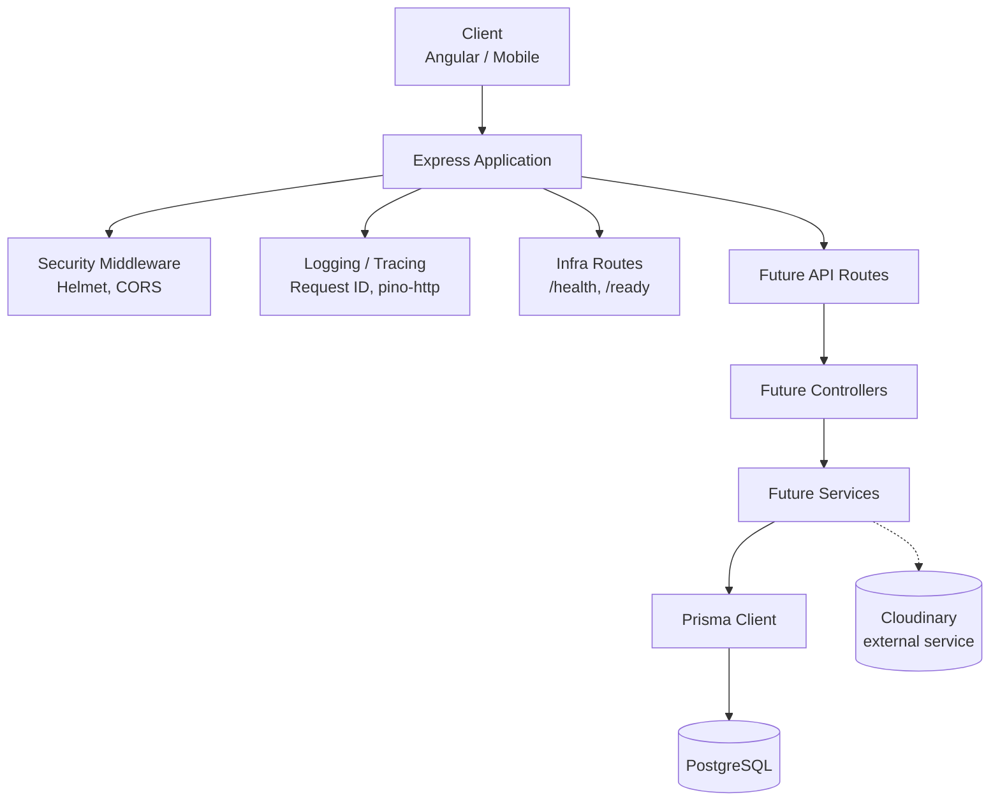
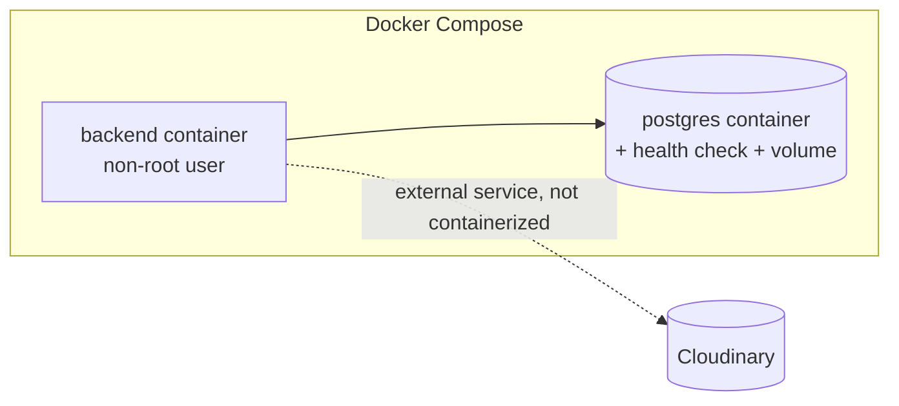

# Architecture

This document describes the backend **foundation** for the School Management System: what
exists, why it exists, and the decisions a future business-module implementation should follow.
No business domain is implemented yet — see the root [README](../README.md) for setup.

## 1. Application Architecture



`app.js` and `server.js` are deliberately separate:

- **`app.js`** builds and configures the Express application (middleware, routes, error
  handling) and exports a factory (`createApp()`). It has no knowledge of ports, signals, or
  process lifecycle — this is also what lets tests import and exercise the app with Supertest
  without binding a real socket.
- **`server.js`** owns everything about the running process: reading config, connecting to the
  database, starting the HTTP listener, and handling shutdown/signals/crashes.

## 2. Configuration Architecture

```text
Environment Variables → Zod validation (src/config/env.js) → env object → rest of the app
```

No file outside `src/config/env.js` reads `process.env` directly. `env.js` validates every
variable with Zod at startup and fails fast (`process.exit(1)`) with a readable list of problems
if anything is missing or malformed — this turns a class of production misconfiguration bugs into
an immediate, loud startup failure instead of a runtime surprise.

`config/logger.js`, `config/cors.js`, `config/database.js`, and `config/cloudinary.js` each
consume the validated `env` object and expose a ready-to-use value (a logger instance, CORS
options, connection/health helpers, a configured Cloudinary SDK) — nothing else in the codebase
constructs these from raw environment variables.

## 3. Database Architecture

- **PostgreSQL** is the only supported database.
- **Prisma** is the ORM. `prisma/schema.prisma` currently defines only the `datasource` and
  `generator` blocks — no models. The domain model (User, Student, Teacher, School, Class,
  ...) will be designed as a dedicated task once requirements are settled, since getting it
  wrong after data exists is expensive.
- **Prisma version pinned to the 6.x line (6.19.3)**, not the newly-released Prisma 7. Prisma 7
  requires a separate `prisma.config.ts` file and driver adapters (e.g. `@prisma/adapter-pg`)
  just to read `DATABASE_URL` — a bigger, less-established surface for a foundation that should
  be boring and well-documented. This is a deliberate deviation from "always use latest" in favor
  of stability; revisit once Prisma 7's adapter-based workflow is more established.
- **One Prisma client instance** (`src/lib/prisma.js`), cached on `globalThis` in non-production
  environments to survive `nodemon` reloads without exhausting the connection pool. No other file
  instantiates `PrismaClient`.
- **`src/config/database.js`** owns the connection lifecycle: `connectDatabase()` on startup,
  `disconnectDatabase()` during graceful shutdown, and `checkDatabaseHealth()` for `/ready`.
- **Transactions**: no transaction helper exists yet, and none should be added speculatively.
  The rule for future modules is simple — _operations that must be atomic use
  `prisma.$transaction(...)` at the service layer_, not a bespoke abstraction.

## 4. Middleware Flow

```text
Request
  → Request ID           (correlation id on req.id + X-Request-Id response header)
  → Helmet                (security headers)
  → CORS                  (env-driven allowlist)
  → pino-http              (structured request/response logging, keyed by req.id)
  → JSON / urlencoded body parsers (1mb limit)
  → Routes (/health, /ready today; future feature routers later)
  → 404 handler
  → Centralized error handler
Response
```

The 1mb body limit is a deliberate default against unbounded JSON payloads; it is not a hard
architectural constraint and can be raised per-route later (e.g. bulk import endpoints) once
those exist.

## 5. Error Handling

- **`src/utils/api-error.js`** defines `ApiError`, the only error type the rest of the app should
  throw intentionally (`ApiError.notFound()`, `.badRequest()`, `.validation()`, etc.). It carries
  a `statusCode`, a machine-readable `code`, and an `isOperational` flag.
- **`src/middlewares/error.middleware.js`** is the single place that turns _any_ thrown value
  (an `ApiError`, a `ZodError`, an `http-errors` instance from body-parser, or an unexpected bug)
  into a consistent JSON response:

  ```json
  { "success": false, "error": { "code": "VALIDATION_ERROR", "message": "...", "details": [] } }
  ```

  Errors with `statusCode >= 500` are logged at `error` level with the full stack; in
  `NODE_ENV=production` their message is replaced with a generic "Internal server error" so
  internals are never leaked to clients. Everything below 500 is logged at `warn` and returned
  as-is, since those are expected, operational failures (bad input, not found, etc.).

- **No `asyncHandler` wrapper was added.** Express 5 (used here) automatically forwards rejected
  promises from `async` route handlers to `next()`, which the old `try { ... } catch { next(e) }`
  boilerplate (and the wrapper that avoided it) existed to work around in Express 4. Adding the
  wrapper back would be a redundant abstraction over behavior Express already provides — this is
  a deliberate deviation from the originally suggested folder layout.

## 6. Logging

- **Pino** for structured logs; **pino-http** attaches a per-request child logger keyed by the
  request ID set in `request-id.middleware.js`, so every log line for a request — from the HTTP
  layer down to a future service/repository — can be correlated.
- In development, logs are piped through `pino-pretty` for readability; in production they are
  raw JSON, suitable for ingestion by any log aggregator.
- `logger.js` configures Pino's `redact` option to strip `authorization`/`cookie` headers and any
  `password`, `token`, `secret`, or `apiKey`/`apiSecret` fields wherever they appear in logged
  objects, so secrets and credentials never reach log output even if a future module logs a
  request/response body carelessly.

## 7. Security Baseline

| Concern          | Mechanism                                                                                                                                                                             |
| ---------------- | ------------------------------------------------------------------------------------------------------------------------------------------------------------------------------------- |
| Security headers | Helmet (defaults)                                                                                                                                                                     |
| CORS             | Explicit env-driven allowlist (`src/config/cors.js`); no origin → same-origin/server-to-server request, always allowed; unknown origin → `403 FORBIDDEN`, not a silent block or a 500 |
| Body size        | 1mb limit on JSON/urlencoded parsers                                                                                                                                                  |
| Secrets          | Zod-validated env vars only; `.env` is git-ignored; `.env.example` documents required keys with empty values                                                                          |
| Error responses  | Sanitized in production (see §5)                                                                                                                                                      |
| Password hashing | `bcryptjs`, cost factor 12 (see `src/utils/password.js`)                                                                                                                              |
| JWT              | `jsonwebtoken`, separate access/refresh secrets (see §8)                                                                                                                              |
| Rate limiting    | **Not added** — see rationale below                                                                                                                                                   |

**Rate limiting was evaluated and deliberately not added yet.** A generic rate limiter with no
routes to protect either does nothing meaningful or has to guess at limits for endpoints that
don't exist yet (auth, search, uploads all want very different limits). Adding it now would be
exactly the kind of speculative infrastructure this task warns against. It should be introduced
alongside the first rate-sensitive route (most likely `/api/auth/login`), scoped to that route,
using `express-rate-limit` or an equivalent.

## 8. Authentication & Password Hashing Foundation (not wired to any route)

- `src/utils/jwt.js` provides `signAccessToken` / `signRefreshToken` / `verifyAccessToken` /
  `verifyRefreshToken`, using **two separate secrets** (`JWT_ACCESS_SECRET`,
  `JWT_REFRESH_SECRET`). Separating them means a refresh-token compromise/rotation doesn't force
  invalidating every live access token and vice versa. Access tokens default to a short lifetime
  (`15m`), refresh tokens to a long one (`7d`) — tune per real requirements once login exists.
- `src/utils/password.js` wraps `bcryptjs` (`hashPassword` / `comparePassword`) at cost factor 12.
  `bcryptjs` (pure JS) was chosen over native `bcrypt` to avoid a native-addon build step in
  Docker/CI across architectures; if hashing throughput ever becomes a measured bottleneck,
  swapping to native `bcrypt` or `argon2` is a drop-in change behind this same two-function API.
- **No signup/login/refresh routes exist.** These utilities exist so the future `auth` module can
  consume them without re-deciding hashing cost or token secret strategy.

## 9. Validation Architecture

Zod is the standard validation library. The intended flow for every future endpoint:

```text
Request → Zod schema (module-owned, e.g. student.schema.js) → parsed/typed data → controller
```

Zod is already load-bearing infrastructure here (env validation, error normalization for
`ZodError` in the global error handler) — no separate "validation middleware factory" has been
built yet, since with zero real schemas to validate against it would be speculative. When the
first module lands, the pattern is: call `schema.parse(req.body)` (or a tiny
`validate(schema) => (req, res, next) => {...}` middleware, whichever proves less boilerplate
once there's a second schema to compare against) and let a thrown `ZodError` fall through to the
existing global error handler, which already knows how to format it.

## 10. API Response Contract

Decided and documented now so every future module is consistent from the start:

```json
// success
{ "success": true, "data": {}, "message": "..." }

// failure
{ "success": false, "error": { "code": "VALIDATION_ERROR", "message": "...", "details": [] } }
```

The failure shape is already implemented by `error.middleware.js`. The success shape is not
enforced by any wrapper/helper yet — introducing a generic `res.success()` helper before there is
a real controller to call it from would be exactly the premature abstraction this task warns
against. Apply the shape by convention when the first controller is written.

## 11. Folder Structure

```text
src/
  app.js              Express app factory: middleware, infra routes, error handling
  server.js           Process lifecycle: DB connect, listen, graceful shutdown, signal handling
  config/
    env.js            Zod-validated environment configuration (the only process.env reader)
    logger.js         Pino instance (dev pretty-print, prod JSON, redaction)
    cors.js           Env-driven CORS allowlist
    database.js       Prisma connect/disconnect/health-check lifecycle
    cloudinary.js     Cloudinary SDK configuration (unused until upload features exist)
  constants/
    index.js          HTTP_STATUS — infrastructure constants only
  middlewares/
    request-id.middleware.js
    not-found.middleware.js
    error.middleware.js
  utils/
    api-error.js      ApiError class + factory helpers
    jwt.js            Access/refresh token sign/verify (unused by any route yet)
    password.js       bcrypt hash/compare (unused by any route yet)
  lib/
    prisma.js         The single PrismaClient instance
  modules/
    .gitkeep          Future feature modules (students, teachers, ...) go here
prisma/
  schema.prisma       datasource + generator only, no models
tests/
  unit/               Pure logic, no I/O (api-error.test.js)
  integration/        Supertest against createApp() (app.test.js)
```

Directories from the suggested layout that were **not** created, and why:

- No `asyncHandler` util — see §5.
- No `student.controller.js`-style module scaffolding — explicitly out of scope for this task;
  `src/modules/` exists (with a `.gitkeep`) purely to reserve the location.

## 12. Future Module Architecture

Feature-first modules under `src/modules/<feature>/`, e.g.:

```text
src/modules/students/
  student.routes.js       Express router, mounted in app.js
  student.controller.js    Parses request, calls service, shapes response
  student.service.js       Business logic, orchestrates Prisma calls (and transactions)
  student.schema.js        Zod schemas for this module's inputs
  student.constants.js     Module-local constants (not shared infra constants)
```

### Decision: Controller → Service → Prisma (no Repository layer)

Considered:

1. Controller → Service → Repository → Prisma
2. **Controller → Service → Prisma** (chosen)

Prisma's query builder already _is_ a data-access abstraction — it is swappable, testable (via
`prisma-mock`/a test database), and type-safe at the query level. A repository layer on top would
mostly re-expose the same methods Prisma already provides, adding a file and an indirection per
model without a corresponding benefit unless we anticipated swapping the underlying database
technology, which is not a real constraint here. Given the goal is an _understandable_, "boring"
codebase (§48 of the task brief) rather than a maximally-layered "enterprise" one, services call
Prisma directly. If a specific module later needs to isolate genuinely complex or reused queries,
that can be a query-builder function local to that module — it does not need to become a
project-wide architectural layer.

## 13. Deployment Architecture



- **Dockerfile**: multi-stage (`base` → `deps` / `build` → `runtime`), uses `oven/bun:1.4-alpine`,
  runs `prisma generate` in a build stage, ships only production `node_modules` plus the
  generated Prisma client into the final image, and runs as a non-root user. `.env` is never
  copied into the image — configuration is injected at run time (`env_file`/`environment` in
  compose, or the orchestrator's secret mechanism in real deployments).
- **docker-compose.yml**: exactly two services — `backend` and `postgres` (with a persistent
  volume and a `pg_isready` health check that `backend` waits on). Cloudinary is external and
  intentionally not containerized.
- **`Dockerfile.npm`**: a placeholder/example variant of the same multi-stage layout, built with
  npm instead of Bun, for machines that have Docker but not Bun (e.g. Windows). It is not the
  canonical build. It intentionally uses `node:22-alpine`, not `node:20-alpine` — npm 10.8.2
  (bundled with `node:20-alpine`) fails on this project's dependency graph with an internal
  arborist error (`Cannot read properties of null (reading 'edgesOut')`) when installing without
  a lockfile; npm 10.9.x (`node:22-alpine`) does not hit this. No `package-lock.json` is
  committed (the project keeps a single lockfile, `bun.lock`), so it runs `npm install` rather
  than `npm ci` — less reproducible, acceptable for a placeholder.
- Docker itself is not installed in the environment this foundation was authored in, but Podman
  (a Docker-CLI-compatible engine) was available and used to actually build and run both images:
  `podman build` succeeded for both `Dockerfile` and `Dockerfile.npm`; each container was run
  against a real `postgres:16-alpine` container on a shared network (mirroring what
  `docker-compose.yml` does) and verified for `/health` (200), `/ready` (200, confirms live DB
  connectivity from inside the container), running as the non-root `appuser`, and clean
  `SIGTERM` shutdown (HTTP server closed → Prisma disconnected → exit 0). `docker-compose.yml`
  itself was not run directly (no `docker compose`/`podman-compose` binary in this environment)
  but its equivalent two-container setup was exercised manually as described above.

## 14. What Is Explicitly Out of Scope Here

Authentication/authorization flows, RBAC, and every business domain module (users, students,
teachers, parents, schools, classes, attendance, examinations, fees, transport, notifications,
reports, dashboards, file-upload endpoints) are not implemented. This document exists so that
work can start directly on the first real module without re-litigating the decisions above.

## 15. Open Decisions for the First Business Module

- Database schema/domain model design (entities, relationships, multi-tenancy strategy if one
  school-management instance serves multiple schools).
- Whether routes are versioned (`/api/v1/...`) from the start — recommended, but not yet decided
  since no route exists to version.
- The concrete authorization model (roles vs. permissions vs. both) once real user types exist.
- Whether/when to introduce a generic `res.success()` response helper (see §10) once there are
  enough controllers to justify it.
- Rate limiting scope and thresholds, introduced with the first rate-sensitive route (see §7).
